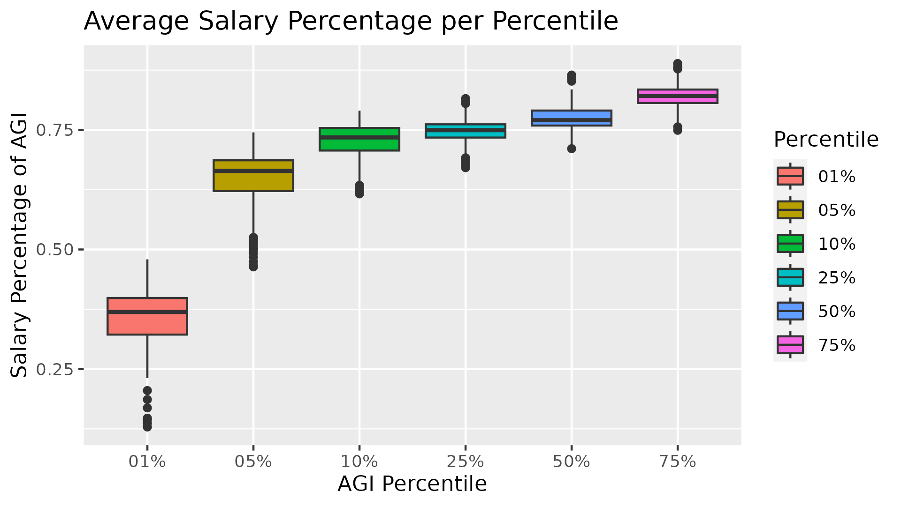
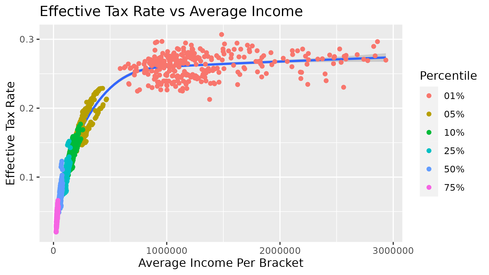

# Analysis of the effects of Salary on Taxes

This project initially started off as an attempt to see if different states had different federal effective tax rates (ETR) on the 1% of this country. Utilizing linear models, this was determined to be incorrect for the top 1% of this country, but accurate for other percentiles. This made me question why this was true.

I began a second analysis of determining the AGI makeup of the different AGI-percentiles, and it was interesting to note a few things:

1.  The AGI of the 1% is the only bracket where salary was NOT the majority of their income (35% of AGI for the 1% vs 64% of AGI for the 5%)

    

2.  The ETR plateau at about 1 million AGI, around 35%. One issue here is that since we are only looking at average income per bracket, its not possible to really check the actual point of plateau.

    It appears that the 1% achieve this tax "plateau" via diversifying their AGI sources. Since salary is traditionally thought of as the most taxed AGI source, while sources like captial gains is capped at 15%, there are many ways for the 1% to avoid paying income taxes.

    | 1%    | 5%    | 10%   | 25%   | 50%   | 75%      |
    |-------|-------|-------|-------|-------|----------|
    | 0.161 | 0.282 | 0.165 | 0.204 | 0.116 | Not Sig. |

    : The slope of salary when compared to the ETR of each respective percentile

3.  Salary appears to be a large driver of taxes for every bracket except the 75%. What is interesting is that Salary is a larger drive of taxes for the 5% then the 1%, while the 10% and the 1% have salary being drivers of similar strength. This makes sense since while the 1% do pay more in salary/income taxes, its a smaller percentage of their income then the 5%.
